# Vault

## 1. Project Overview

Vault is a zero-knowledge, end-to-end encrypted credential management system for Android. It ensures that sensitive passwords, tokens, and credentials remain private and secure at all times. All local data is protected using hardware-backed cryptographic keys residing in the device's Trusted Execution Environment (TEE), and all remote synchronization and sharing workflows are end-to-end encrypted (E2EE), meaning the central sync server operates strictly on encrypted payloads and never possesses decryption keys or plaintext data.

- **APK Download:** [Download Vault APK](https://drive.google.com/file/d/1bHbyFUwpU5Y4wKQpGdFewlOO_xTXCgsZ/view?usp=drive_link)

---

## 2. Engineering

- **Architecture:** 100% Self made
- **Code:** 100% AI generated

---

## 3. Key Features

- **Local Storage backed by Android TEE:** Credentials stored in the local SQLite database (Room) are encrypted at rest using an asymmetric RSA-2048 private key isolated within Android Keystore (backed by TEE / StrongBox hardware). Private keys cannot be extracted, exported, or accessed by other applications.
- **End-to-End Encrypted (E2EE) Device Sync:** Synchronize credentials across multiple devices belonging to the same user without compromising confidentiality. Each device possesses a unique hardware-backed key pair; data is encrypted per target device using hybrid cryptography before leaving the origin device.
- **Secure Peer-to-Peer Credential Sharing:** Securely share individual credentials with other registered Vault users. Payloads are encrypted directly with the recipient devices' public keys, ensuring only the intended recipient's hardware can decrypt the shared secrets. The owner retains full control to push updates or revoke access.

---

## 4. Architectural Overview

### Cryptographic Architecture

The app uses a hybrid cryptographic model combining asymmetric key encapsulation and authenticated symmetric stream encryption. Hardware isolation ensures sensitive operations are confined to secure hardware elements.

| Component / Layer | Algorithm & Ciphersuite | Purpose |
| :--- | :--- | :--- |
| **Local Key Management** | **Android Keystore (TEE / StrongBox)** | Generates and safeguards the device's master RSA-2048 key pair (`vault_keypair`). The private key is non-exportable and never leaves hardware memory. |
| **Local Credential Encryption** | **RSA/ECB/OAEPWithSHA-256AndMGF1Padding** | Encrypts local credential JSON payloads stored inside Room database. Utilizes SHA-256 as the primary digest and MGF1 with SHA-1 for mask generation. |
| **Session & Token Storage** | **AES-256-SIV & AES-256-GCM** via `EncryptedSharedPreferences` | Stores authentication credentials and active device session metadata. Keys are encrypted with AES-256-SIV (deterministic), while values use AES-256-GCM (authenticated). |
| **Per-Device Hybrid Payload Encryption (Sync & Share)** | **AES-256-GCM (`AES/GCM/NoPadding`)** | Encrypts arbitrary-length credential JSON payloads using an ephemeral 256-bit AES key generated via `SecureRandom`, a 12-byte (96-bit) IV, and a 128-bit authentication tag for integrity verification. |
| **Key Encapsulation (Sync & Share)** | **RSA-OAEP-256 (`RSA/ECB/OAEPWithSHA-256AndMGF1Padding`)** | Encrypts the ephemeral AES-256 session key under the target device's public RSA key. |
| **Binary Wire Format** | `[2B Key Length \| Encrypted AES Key \| 12B IV \| AES Ciphertext]` | Compact binary framing for hybrid encrypted payloads transmitted over the network (encoded in Base64). |
| **Biometric Access Control** | **AndroidX BiometricPrompt (`BIOMETRIC_STRONG` / Device Credential)** | Enforces biometric (fingerprint/face) or screen lock verification before decrypting and viewing credentials, with an in-memory session window of 10 seconds. |

---

### Sync Architecture

When synchronizing a credential across a user's registered devices:
1. **Device A** queries the sync server for all registered devices belonging to the authenticated account.
2. For every target device (including **Device B**), **Device A** generates an ephemeral AES-256 key, encrypts the credential JSON with AES-256-GCM, and encrypts the AES key using that target device's RSA public key (RSA-OAEP).
3. The resulting hybrid encrypted packages are uploaded to the sync server.
4. **Device B** requests pending sync payloads, decrypts the ephemeral AES key inside its own TEE using its non-exportable private key, decrypts the ciphertext with AES-256-GCM, and stores the credential locally.

```mermaid
sequenceDiagram
    autonumber
    participant A as Device A (Originating)
    participant TEE_A as Device A Keystore (TEE)
    participant S as Vault Sync Server
    participant B as Device B (Target)
    participant TEE_B as Device B Keystore (TEE)

    Note over A,S: 1. Discover Registered Devices
    A->>S: GET /device (HTTP Basic Auth)
    S-->>A: Return Device List [Device B (PubKey_B), ...]

    Note over A,TEE_A: 2. Decrypt Local Credential & Hybrid Encrypt
    A->>TEE_A: Decrypt local credential using PrivKey_A
    TEE_A-->>A: Plaintext Credential JSON
    rect rgb(20, 30, 45)
        Note over A: Generate ephemeral AES-256 key<br/>Encrypt payload with AES-256-GCM (random 12B IV)<br/>Encrypt AES key with PubKey_B (RSA-OAEP)
    end

    Note over A,S: 3. Upload Per-Device Encrypted Blobs
    A->>S: POST /sync [{ deviceId: "B", content: PackedBlob_B }]
    S-->>A: 200 OK (Sync confirmed, assigned credentialId)

    Note over S,B: 4. Target Device Ingestion
    B->>S: GET /sync/{deviceId_B}
    S-->>B: Return Encrypted Items [{ credentialId, content: PackedBlob_B }]

    Note over B,TEE_B: 5. Hardware Decryption & Local Storage
    B->>B: Unpack [KeyLen | EncKey | IV | Ciphertext]
    B->>TEE_B: Decrypt EncKey using PrivKey_B (RSA-OAEP)
    TEE_B-->>B: Plaintext AES-256 Key
    B->>B: Decrypt Ciphertext using AES-256-GCM
    B->>TEE_B: Re-encrypt plaintext with PubKey_B for local storage
    TEE_B-->>B: Local Ciphertext
    B->>B: Insert / Update in local Room database (isSynced = true)
```

---

### Share Architecture

When sharing a credential peer-to-peer with another user:
1. **Device A (Owner)** queries the sync server for the recipient user's registered devices.
2. **Device A** decrypts the local credential, performs hybrid encryption using the recipient device's public key, and sends the payload to the server.
3. The server validates that the sender is not sharing to themselves and creates or updates a `SharedCredential` record.
4. **Device B (Recipient)** retrieves incoming shared payloads for its device ID, decrypts the payload via its secure hardware (TEE), and saves it marked as a received shared item.
5. If the owner modifies the credential, **Device A** publishes the update to all active recipient devices (`publishSharedUpdate`). If revoked, the server deletes the share records and the recipient's device prunes the item upon synchronization.

```mermaid
sequenceDiagram
    autonumber
    participant A as Device A (Owner)
    participant TEE_A as Device A Keystore (TEE)
    participant S as Vault Sync Server
    participant B as Device B (Recipient)
    participant TEE_B as Device B Keystore (TEE)

    Note over A,S: 1. Lookup Recipient Devices
    A->>S: GET /device?username={recipientUsername}
    S-->>A: Return Recipient Devices [Device B (PubKey_B)]

    Note over A,TEE_A: 2. Decrypt Local & Hybrid Encrypt for Recipient
    A->>TEE_A: Decrypt local credential using PrivKey_A
    TEE_A-->>A: Plaintext Credential JSON
    rect rgb(20, 30, 45)
        Note over A: Generate ephemeral AES-256 key<br/>Encrypt payload with AES-256-GCM<br/>Encrypt AES key with Recipient PubKey_B (RSA-OAEP)
    end

    Note over A,S: 3. Dispatch Shared Credential
    A->>S: POST /share/{recipientUsername} [{ deviceId: "B", sharedCredId: null, content: PackedBlob_B }]
    S-->>A: 200 OK { id: sharedCredId, owner: "ownerUsername" }
    A->>A: Update local entity (isShared = true, serverShareId)

    Note over S,B: 4. Recipient Pulls Shared Items
    B->>S: GET /share/{deviceId_B}
    S-->>B: Return Shared Items [{ sharedCredId, content: PackedBlob_B }]

    Note over B,TEE_B: 5. Recipient Hardware Decryption
    B->>B: Unpack [KeyLen | EncKey | IV | Ciphertext]
    B->>TEE_B: Decrypt EncKey using PrivKey_B (RSA-OAEP)
    TEE_B-->>B: Plaintext AES-256 Key
    B->>B: Decrypt Ciphertext with AES-256-GCM
    B->>TEE_B: Re-encrypt plaintext with PubKey_B for local storage
    TEE_B-->>B: Local Ciphertext
    B->>B: Insert into Room (isShared = true, isReceived = true)

    opt Revocation / Deletion
        A->>S: DELETE /share/{sharedCredId}
        S-->>A: 204 No Content (Deleted globally)
        B->>S: GET /share/{deviceId_B}
        S-->>B: Empty list / 404
        B->>B: Prune revoked shared credential from local Room database
    end
```

